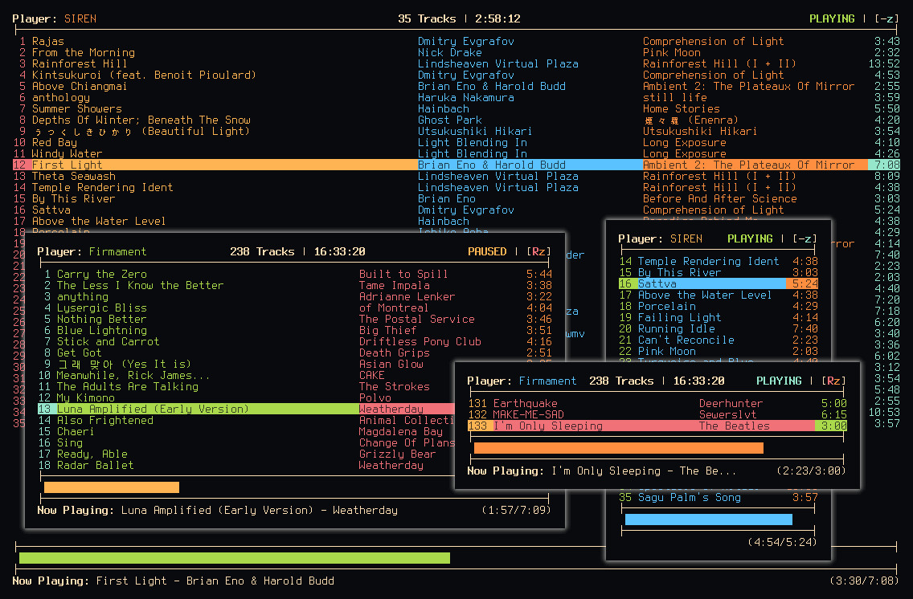

# lyra

A TUI app for viewing Logitech Media Server playback

------------------------------------------------------------------------------



## What is lyra and why does it exist?

_lyra_ is a lightweight, read-only "viewport" that displays the current playlist
of a selected player connected to the provided Logitech Media Server (LMS).

For a while now, I've been using [horizon](https://github.com/Nynergy/horizon)
to control my LMS from the terminal. However, it's not exactly the most
efficient in terms of server queries and data manipulation. It's also written in
Python, and I've been having a lot of fun working with Rust for my TUI apps
lately, so I decided I would create a similar app in Rust.

Rather than rewrite the entire project, I decided to make a simple viewer for
the current playlist of a connected player, and try to make it as polished as I
can. I took a lot of ideas from _horizon_ and my previous Rust TUI program
[kadai](https://github.com/Nynergy/kadai) and combined them into this app.

Perhaps in the future I will take what I've learned here with _lyra_ and
actually rewrite _horizon_ in Rust.

## What exactly does it do?

When you invoke _lyra_ on the command line, it will present you with a list of
players, if any are connected to the LMS you provided in the configuration file
(more on that file later).

Once you select a player from the list, _lyra_ will continuously query against
the server for information regarding the player and its internal playlist. This
information is presented to you in a simple and colorful playlist view, with
player info at the top and progress info at the bottom.

Depending on the size of the terminal, some columns may be omitted from the
playlist section. For example, the track titles, indices, and durations are
always visible, but the artist and album may disappear as you shrink the
terminal. This is to keep things from getting too cluttered/truncated.

Various other information from the header and footer may also be changed/omitted
in a similar way.

Hit 'p' while in the playlist view to return back to the player menu view. Hit
'q' at any time in any view to quit _lyra_.

It's very simple in terms of controls because it is not a **controller**, nor a
**player**, but simply a **viewer**.

## How can I compile and run it?

First, you need to clone the repo:

```bash
$ git clone https://github.com/Nynergy/lyra.git
$ cd lyra
```

To build the app and mess around with it, ensure you have a valid config file in
the ~/.lyra directory, then do:

```bash
$ cargo build
$ cargo run
```

To install it into your Cargo installation's install root, do:

```bash
$ cargo install --path .
```

Just be sure that your Cargo install root is in your PATH environment variable,
otherwise your shell won't know where to find the installed binary. Once it's
installed, you can run the app by simply running `lyra`.

## How do I use it?

Once installed, it's as easy as `lyra`, but make sure you have a valid config
file in the correct location.

_lyra_ uses a single JSON file as the configuration. This is used to specify the
IP and port number where your LMS is running, as well as any color configuration
you want to do.

This file, which is called `config.json` must be located in your user's hidden
`.lyra` directory. If this directory doesn't exist, create it using `mkdir
$HOME/.lyra`, then place the config file inside that directory.

The config file ***must*** contain, at a minimum:

```json
{
    "lms_ip": "192.168.0.188",
    "lms_port": "9000"
}
```

In your case, you would specify the IP and port that your LMS is running on,
rather than the exact ones I have used above. If you want to configure any
colors to something other than the default ones, you can add any/all of the
following to your config:

```json
{
    "lms_ip": "192.168.0.188",
    "lms_port": "9000",
    "colors": {
        "Banner": 2,
        "PlayerName": 1,
        "PlayingIndicator": 2,
        "PausedIndicator": 3,
        "StoppedIndicator": 1,
        "RepeatIndicator": 5,
        "ShuffleIndicator": 6,
        "TrackIndex": 5,
        "TrackTitle": 3,
        "TrackArtist": 4,
        "TrackAlbum": 1,
        "TrackDuration": 6,
        "PlaybarGauge": 2
    }
}
```

The name signifies what is being configured, and the number is the index of the
color in your terminal, similar to how something like .Xresources numbers its
colors. These can be anything from 0-255, but for the most part you'll probably
keep it from 1-7. Play around with the numbers and see what you like. The ones I
have listed above are the defaults.

Keybindings for the various interfaces are the following:

#### Player Select Menu

Key | Action
----|-------
<kbd>q</kbd> / <kbd>Esc</kbd> | quit lyra
<kbd>j</kbd> and <kbd>k</kbd> / <kbd>Up</kbd> and <kbd>Down</kbd> | change player focus up and down
<kbd>g</kbd> and <kbd>G</kbd> / <kbd>Home</kbd> and <kbd>End</kbd>| jump to top or bottom of list
<kbd>Space</kbd> / <kbd>Enter</kbd> | select player to view

#### Playlist View

Key | Action
----|-------
<kbd>q</kbd> / <kbd>Esc</kbd> | quit lyra
<kbd>p</kbd> | return to the player select menu

## Now what?

Use it, listen to some good music. Have fun :)
